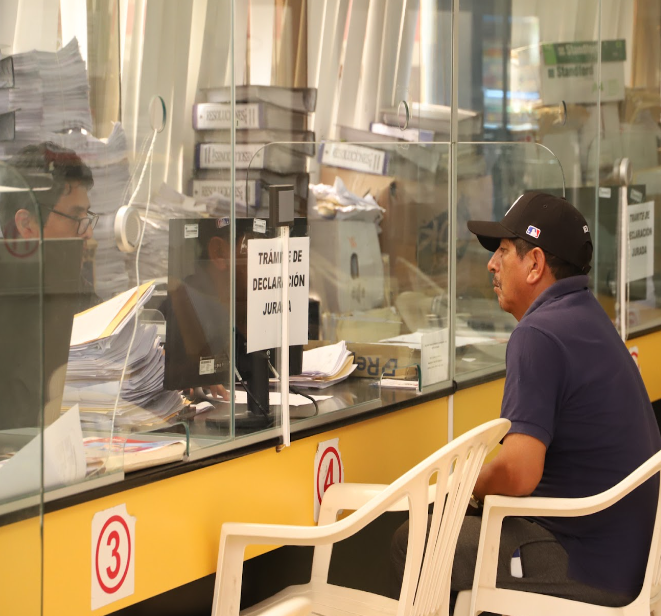
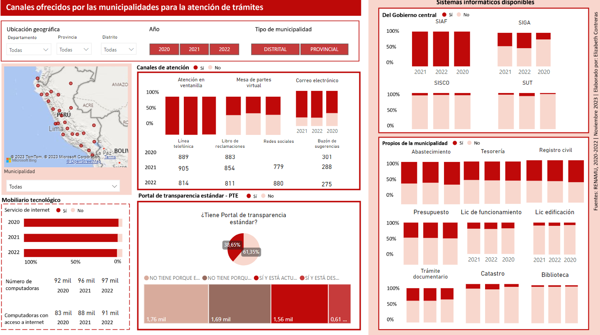
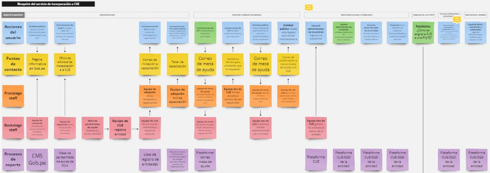
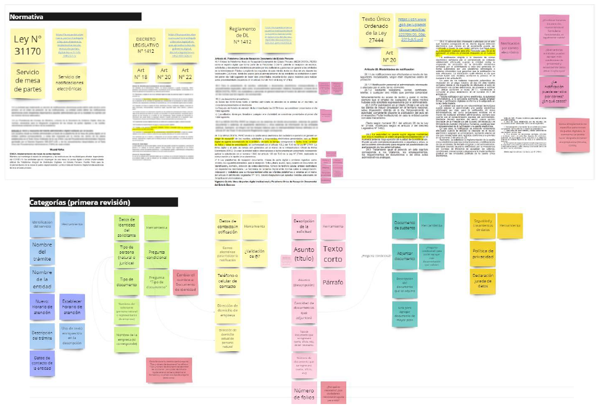
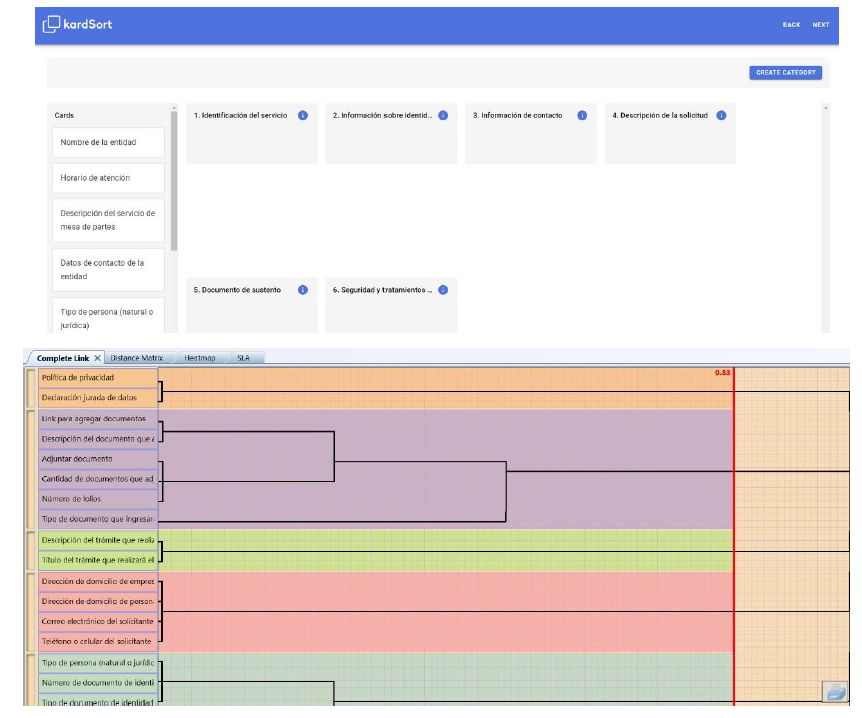
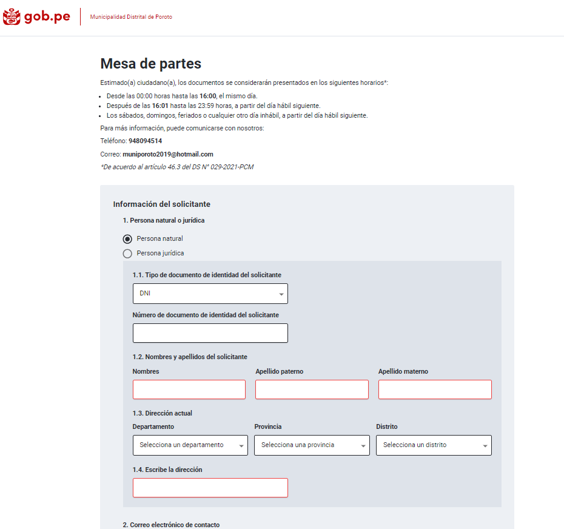
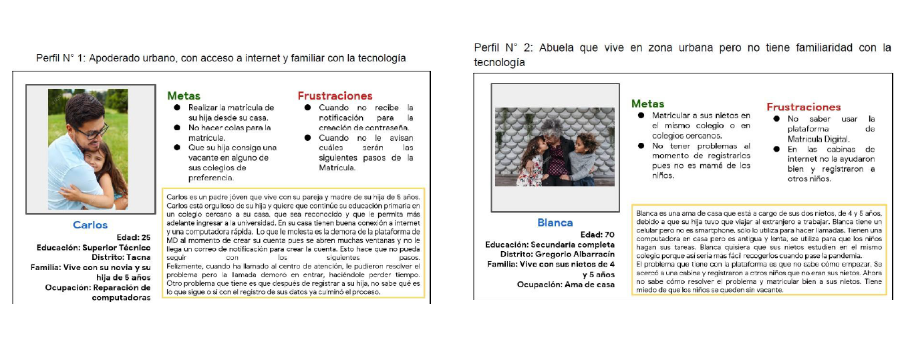
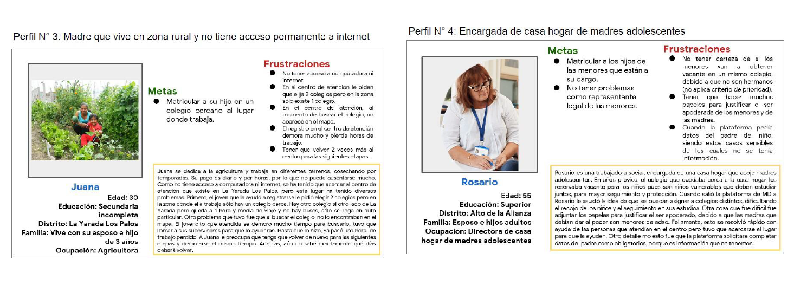

# Quantitative UX researcher

Hi, I'm Elizabeth, I'm a social scientist by training but have always had a close connection with the world of data and research throughout my career in public management. Although I started working in 2015, it was in 2019 that I shifted my career towards user experience research for the design and innovation of digital platforms. Even though I lean more towards a quantitative approach, I really enjoy using qualitative and mixed methods to get a deeper understanding of users and businesses.
Let's connect: e.contrerasmarin@gmail.com

## Projects
### Identifying opportunities to digitalize products and services in Peru's local governments (2023)
#### _Client: Secretary of Government and Digital Transformation_
##### Role: UX Researcher
#### Summary: 
The Secretary of Government and Digital Transformation is a public entity responsible for the country's digital transformation to improve citizen's lifes through innovative digital products and services. The objective of this project was to discover opportunities to design and develop new products based on evidence. 

   

#### What I did: 
In order to start this exploration I selected an avaiable and public dataset about local government called the [National Registry of Municipalities (RENAMU)](https://www.datosabiertos.gob.pe/dataset/registro-nacional-de-municipalidades-renamu-2022-instituto-nacional-de-estad%C3%ADstica-e), which consist on a national-base survey about different topics about local management and tools on  1874 municipalities. Next, I validated this selection with the stakeholders and once I have and approval, I started the analysis process based on a four steps process:

- Downloaded the dataset and the survey questionnaire to understand the data and to select the avaiable and relevant tables and questions
- Explored the selected tables and questions and created a common ID to join tables by an ID
- Conducted an exploratory analysis in SPSS to answer some business questions such as: what are the main procedures demmand by citizens that could be digitalize in municipalities? how often do municipalities use digital platforms?
    - [Findings report](https://drive.google.com/file/d/14tWgj-NUiqFxhSTZHdzvWQJc05DTht1F/view?usp=sharing)
    - [Data dictionary](https://docs.google.com/spreadsheets/d/150IxhbslOilE_80mSjkCfu7En3vzXFXO/edit?usp=sharing&ouid=106305285872469110916&rtpof=true&sd=true)
    - [Powerpoint presentation](https://docs.google.com/presentation/d/15B9vGfa4qRsFQCjUAbdC8mZ9UnpXeAc6/edit?usp=sharing&ouid=106305285872469110916&rtpof=true&sd=true),
- Designed, elaborated and validated a dashbord on Power-Bi to understand the status about municipalities procedures.
  
    

#### Tools & skills:
- Cleaning and data exploration with Excel
- Stadistical exploratory analysis with SPSS
- Data visualization with Power BI
- Communication with stakeholders to understand their needs
- Attention to detail when performing the analysis and finding patterns

### Strategic planning with gender and cultural diversity approach (2024)
#### _Client: Inter-American Development Bank_
##### Role: Data consultant
#### Summary: 
The general project objective is to close gender and intercultural gaps on the strategic planning processes in all public entities in Perú. The government counterpart (National Center for Strategic Planning) have some tables about the how public entities register their planning procedures but the data avaiable was difficult to analyze due to its magnitud: it contains 4 sheets in excel, with more than 20,000 rows and 80 columns each. 

#### What I did: 
I helped cleaning the data avaiable on [Google colab using pandas](https://colab.research.google.com/drive/1MIXMwEJfp4uZFKoVvuXGFwXPd9eBnjvC?usp=sharing), on a three steps process:
- Separated the four sheets into separate tables
- Deleted the columns that weren't of interest
- Saved the 4 new and clean tables on a CSV format

#### Tools & skills:
- Data cleaning with Pandas (Python)
- Communication with stakeholders to understand and empathize with their needs

### Service design for the incorporation of public entities into the Government's electronic mailbox "Casilla única electrónica" (2023)
#### _Client: Secretary of Government and Digital Transformation_
##### Roles: UX researcher & service designer
#### Summary: 
"Casilla única electrónica" is digital product aimed at integrating all the documents and results of procedures carried out by Peruvian citizens into a single digital place. To achieve this, it is necessary for each public entity to integrate its internal management systems to Casilla única electrónica, so that the user experience is unified and integrated. But the integration process was difficult and painful because it was too technical and difficult to understand for the majority of public servants.

#### What I did: 
The objective of the research project was to identify how entities could integrate their own systems with the platform in a easy and user-friendly manner, for which I conducted in-depth interviews to identify needs and create a blueprint of the ideal service the balance technical requirements and user profiles. I used [Nick Remi's book](https://www.dga.or.th/wp-content/uploads/2019/09/file_26e487aea69af163911dc4f6e6b8abd4.pdf) as a guide to this project.

   
   Board and final blueprint: https://miro.com/app/board/uXjVMw4RTiI=/?share_link_id=680470187414

#### Tools & skills:
- In-depth interviews using Google sheets and Miro to systematize information
- Blueprinting using Miro

### Identification of minimum elements for the development of a pre-designed template for the Facilita platform's document reception desk (mesa de partes) (2021)
#### _Client: Secretary of Government and Digital Transformation_
##### Roles: UX researcher
#### Summary: 
Facilita is the digital request platform of the Peruvian State, created to address a significant need in public entities during pandemic: the digitization of their procedures and services, mainfly for entities that didn't have the financial resources to invest on digital infraestructure. The minimal viable product (MVP) was defined as a digital form, similar to Google forms, where public servants could create any digital form to keep providing their services to citizens. Over time, it became necessary for user entities to have pre-designed templates for the most frequently requested services. One of such service is the document reception desk (mesa de partes)
   
   

#### What I did: 
The objective of the research was to identify minimal elements that should be included into the template, having in mind legal, technical and user requirements. I conducted a mixed-method research that combined card-sorting techniques and in-depth interviews. I followed these steps:
- Reviewed documentation, regulations and laws related to administrative procedures and requests from citizens
- Defined the user profile needed and scheduled the selected candidates
- Designed an interview guide to apply before the card-sorting dynamic
- Structured a closed card-sorting dynamic on [KardSorting](https://kardsort.com/) with predefined categories and elements that users could move
- During the dynamic I keep asking some questions about the categories and elements: if they understood them and if they where relevant or not. I also asked about other elements and categories to include.
- Systematized the findings and identify relevant insights to design the template

   
   

#### Important achievements:
- Created a digital form that could be complete in less than 2 minutes by citizens.
- Facilita's document reception desk template is the current most used services with more than 1800 forms created and used.

   
     Example: https://facilita.gob.pe/t/5320

#### Tools & skills:
- In-depth interviews
- Card-sorting with Kard Sorting platform.

### Improve parent's experiencies with the Digital enrollment platform (2019)
#### _Client: Perú's Ministry of Education_
##### Roles: UX researcher
#### Summary: 
The school enrollment process in Peru generated different problems for families: not knowing the number of vacancies available, requirements that were difficult to obtain, long queues because the process was in-person, among others. To solve this problem, the Ministry of education developed a digital platform that would allow parents know the available vacancies, apply to more than one school and have the same possibility of getting an spot at their prefered school. All of this being remote, through any digital device.

   

#### What I did: 
As a researcher I was asked to identify the main pain points of users during the implementation of the pilot, for which I conducted in-depth interviews with school staff and parent, and created user personas that showed the needs, pain points and expectations with the enrollment process. This helped the development team to empathize with users and to adapt the platform to their needs. 

   
   

#### Tools & skills:
- In-depth interviews
- User personas and user journey. 

#### Important achievements:
- This was my first project working with a digital platform, after many years working on public management and academic research. It was the project that helped me realized that I love working in product and innovation! 
